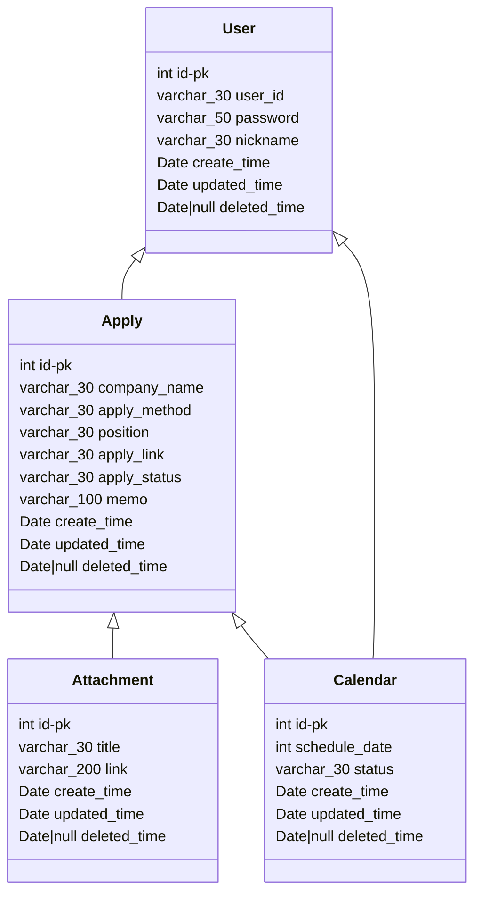

# 단순 express jenkins test 용입니다.

```mermaid
  classDiagram
    User <|-- Apply
    Apply <|-- Attachment
    Apply <|-- Calendar
    User <|-- Calendar

    User: int id-pk
    User: varchar_30 user_id
    User: varchar_50 password
    User: varchar_30 nickname
    User: Date create_time
    User: Date updated_time
    User: Date|null deleted_time

    Apply: int id-pk
    Apply: varchar_30 company_name
    Apply: varchar_30 apply_method
    Apply: varchar_30 position
    Apply: varchar_30 apply_link
    Apply: varchar_30 apply_status
    Apply: varchar_100 memo
    Apply: Date create_time
    Apply: Date updated_time
    Apply: Date|null deleted_time

    Attachment: int id-pk
    Attachment: varchar_30 title
    Attachment: varchar_200 link
    Attachment: Date create_time
    Attachment: Date updated_time
    Attachment: Date|null deleted_time

    Calendar: int id-pk
    Calendar: int schedule_date
    Calendar: varchar_30 status
    Calendar: Date create_time
    Calendar: Date updated_time
    Calendar: Date|null deleted_time


```
